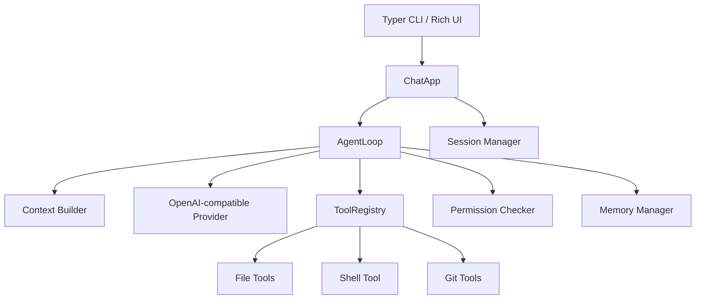

# MiniCode 2.0 实施计划

> **给执行该计划的智能体说明：** 请按任务逐项实现。建议使用 `superpowers:subagent-driven-development` 或 `superpowers:executing-plans` 辅助执行。任务使用复选框格式（`- [ ]`）便于跟踪进度。

**目标：** 将 MiniCode 从已经完成的最小可用版本，推进为可放入简历、可在面试中展开讲解的人工智能编程命令行项目。2.0 版本重点补齐上下文窗口管理、面向 Git 的安全改动流、非交互自动化入口、持续集成与项目展示文档。

**架构原则：** 2.0 不重写现有架构，而是在当前 `CLI -> AgentLoop -> Provider -> Tools -> Permissions -> Storage` 分层上补强。核心新增能力集中在 `agent/context.py`、Git 工具组、Typer 子命令和发布质量设施中，保持模型提供方、工具、命令的既有注册模式。

**技术栈：** Python 3.12+、Typer、Rich、prompt_toolkit、Pydantic v2、OpenAI 兼容模型提供方、pytest、pytest-asyncio、pytest-cov、Ruff、mypy、GitHub Actions。

---

## 当前基线

- 当前代码已有 ReAct 循环、OpenAI 兼容模型提供方、工具注册、文件读写编辑、命令执行工具、权限确认、会话、记忆、斜杠命令。
- 本地验证命令：`.venv\Scripts\python.exe -m pytest --cov=minicode --cov-report=term-missing`
- 当前验证结果：`903 passed`，总覆盖率 `94%`。
- 当前已知问题：运行测试时出现 `GrepFiles._search_with_python` 协程未 await 的警告；当前命令行环境中 `uv` 不在 PATH；部分中文文档在 PowerShell 输出中显示乱码。

## 2.0 范围

2.0 聚焦四条能在简历和面试中讲清楚的主线：

1. **上下文工程**：词元预算、历史裁剪、工具输出压缩、上下文状态可观测。
2. **可验证改动流**：Git 状态、差异摘要、改动追踪、用户已有改动保护。
3. **自动化入口**：`minicode run` 单次任务模式，支持脚本和持续集成使用。
4. **展示质量**：持续集成、README、架构文档、测试警告清理、演示说明。

## 非目标

- 2.0 不引入新的商业模型提供方 SDK。
- 不实现复杂 TUI 或全屏编辑器。
- 不引入真实分词器依赖；2.0 使用可解释的近似词元估算，保留未来替换点。
- 不实现自动提交代码；Git 工具只读或展示差异，写入仍通过现有权限系统控制。

## 发布门槛

2.0 完成时必须满足：

```powershell
.venv\Scripts\python.exe -m pytest
.venv\Scripts\python.exe -m pytest --cov=minicode --cov-report=term-missing
.venv\Scripts\python.exe -m ruff check .
.venv\Scripts\python.exe -m mypy src/minicode
```

预期结果：

- 所有测试通过。
- 没有 pytest RuntimeWarning。
- 覆盖率不低于当前 94% 的主要模块质量水平；新增模块单元测试覆盖核心分支。
- GitHub Actions 在拉取请求和推送时运行 pytest、ruff、mypy。
- README 能说明 2.0 核心能力并提供可复制演示。

---

## 文件结构规划

### 新增文件

- `src/minicode/agent/token_estimator.py`  
  提供轻量词元估算函数，避免把分词器依赖引入命令行工具核心路径。

- `src/minicode/agent/context_models.py`  
  定义 `ContextConfig`、`ContextBuildReport`、`ContextBuildResult`，让上下文构建结果可测试、可展示。

- `src/minicode/tools/git_status.py`  
  面向工作区的 Git 状态工具，输出机器可读状态摘要。

- `src/minicode/tools/git_diff.py`  
  面向工作区的 Git 差异工具，支持查看工作区差异和单文件差异。

- `src/minicode/commands/context_cmd.py`  
  `/context` 命令，展示当前消息数、估算词元数、裁剪数量、工具输出压缩情况。

- `src/minicode/commands/changes_cmd.py`  
  `/changes` 命令，展示当前工作区 Git 状态和差异摘要。

- `tests/test_agent/test_context.py`  
  上下文构建、词元估算、历史裁剪、工具输出压缩测试。

- `tests/test_tools/test_git_status.py`  
  Git 状态工具测试。

- `tests/test_tools/test_git_diff.py`  
  Git 差异工具测试。

- `tests/test_commands/test_context.py`  
  `/context` 命令测试。

- `tests/test_commands/test_changes.py`  
  `/changes` 命令测试。

- `.github/workflows/ci.yml`  
  持续集成工作流。

- `docs/architecture.md`  
  面向简历和开源展示的架构说明文档。

### 修改文件

- `src/minicode/agent/context.py`  
  从简单插入系统提示词升级为带词元预算的上下文构建器。

- `src/minicode/agent/loop.py`  
  接入 `ContextBuildResult`，保存最近一次上下文报告，供 `/context` 读取。

- `src/minicode/config/models.py`  
  在 `AgentConfig` 中加入上下文窗口相关配置。

- `src/minicode/config/loader.py`  
  加入 `MINICODE_CONTEXT_*` 环境变量映射和默认值。

- `src/minicode/tools/__init__.py`  
  注册 Git 工具。

- `src/minicode/commands/__init__.py`  
  注册 `/context` 和 `/changes`。

- `src/minicode/main.py`  
  增加 `minicode run` 非交互子命令。

- `src/minicode/tools/grep.py`  
  清理协程未 await 的测试警告。

- `README.md`  
  修复或重写展示内容，加入 2.0 演示、架构、测试状态。

---

## 阶段 10：上下文工程

### 任务 10.1：词元估算器

**相关文件：**

- 新建：`src/minicode/agent/token_estimator.py`
- 测试：`tests/test_agent/test_context.py`

**接口：**

```python
def estimate_tokens(text: str | None) -> int: ...
def estimate_message_tokens(message: Message) -> int: ...
def estimate_messages_tokens(messages: list[Message]) -> int: ...
```

- [ ] **步骤 1：编写失败的词元估算测试**

在 `tests/test_agent/test_context.py` 中加入：

```python
from minicode.agent.token_estimator import (
    estimate_message_tokens,
    estimate_messages_tokens,
    estimate_tokens,
)
from minicode.providers.base import Message, ToolMessage


def test_estimate_tokens_empty_text_is_zero() -> None:
    assert estimate_tokens(None) == 0
    assert estimate_tokens("") == 0


def test_estimate_tokens_uses_conservative_char_ratio() -> None:
    assert estimate_tokens("abcd") == 1
    assert estimate_tokens("abcde") == 2


def test_estimate_message_tokens_includes_role_overhead() -> None:
    msg = Message(role="user", content="hello world")
    assert estimate_message_tokens(msg) >= estimate_tokens("hello world") + 4


def test_estimate_tool_message_tokens_includes_tool_name() -> None:
    msg = ToolMessage(content="result", tool_call_id="call_1", name="read_file")
    assert estimate_message_tokens(msg) >= estimate_tokens("result") + estimate_tokens("read_file")


def test_estimate_messages_tokens_sums_messages() -> None:
    messages = [
        Message(role="user", content="hello"),
        Message(role="assistant", content="world"),
    ]
    assert estimate_messages_tokens(messages) == sum(estimate_message_tokens(m) for m in messages)
```

- [ ] **步骤 2：运行失败测试**

执行：

```powershell
.venv\Scripts\python.exe -m pytest tests/test_agent/test_context.py -v
```

预期：失败，因为 `minicode.agent.token_estimator` 尚不存在。

- [ ] **步骤 3：实现估算器**

新建 `src/minicode/agent/token_estimator.py`：

```python
"""上下文预算使用的轻量词元估算。"""

from __future__ import annotations

import json

from minicode.providers.base import ContentBlock, Message

CHARS_PER_TOKEN = 4
MESSAGE_OVERHEAD_TOKENS = 4


def estimate_tokens(text: str | None) -> int:
    """使用保守的字符/词元比例估算词元数。"""
    if not text:
        return 0
    return max(1, (len(text) + CHARS_PER_TOKEN - 1) // CHARS_PER_TOKEN)


def _content_to_text(content: str | list[ContentBlock] | None) -> str:
    if content is None:
        return ""
    if isinstance(content, str):
        return content
    return "\n".join(block.text or "" for block in content)


def estimate_message_tokens(message: Message) -> int:
    total = MESSAGE_OVERHEAD_TOKENS
    total += estimate_tokens(message.role)
    total += estimate_tokens(_content_to_text(message.content))
    total += estimate_tokens(message.name)
    total += estimate_tokens(message.tool_call_id)
    if message.tool_calls:
        total += estimate_tokens(json.dumps([tc.model_dump() for tc in message.tool_calls], ensure_ascii=False))
    return total


def estimate_messages_tokens(messages: list[Message]) -> int:
    return sum(estimate_message_tokens(message) for message in messages)
```

- [ ] **步骤 4：验证测试通过**

执行：

```powershell
.venv\Scripts\python.exe -m pytest tests/test_agent/test_context.py -v
```

预期：词元估算相关测试通过。

- [ ] **步骤 5：提交**

```powershell
git add src/minicode/agent/token_estimator.py tests/test_agent/test_context.py
git commit -m "feat: 添加轻量上下文词元估算器"
```

### 任务 10.2：上下文模型与配置

**相关文件：**

- 新建：`src/minicode/agent/context_models.py`
- 修改：`src/minicode/config/models.py`
- 修改：`src/minicode/config/loader.py`
- 测试：`tests/test_config/test_loader.py`
- 测试：`tests/test_agent/test_context.py`

**接口：**

```python
class ContextConfig(BaseModel):
    max_input_tokens: int = 24000
    recent_messages: int = 16
    max_tool_output_chars: int = 12000
    keep_first_user_message: bool = True


class ContextBuildReport(BaseModel):
    original_message_count: int
    final_message_count: int
    original_estimated_tokens: int
    final_estimated_tokens: int
    dropped_message_count: int = 0
    compressed_tool_result_count: int = 0


class ContextBuildResult(BaseModel):
    messages: list[Message]
    report: ContextBuildReport
```

- [ ] **步骤 1：编写配置测试**

在 `tests/test_config/test_loader.py` 中加入：

```python
def test_default_context_config_values() -> None:
    config = AppConfig()
    assert config.agent.context.max_input_tokens == 24000
    assert config.agent.context.recent_messages == 16
    assert config.agent.context.max_tool_output_chars == 12000
    assert config.agent.context.keep_first_user_message is True


def test_context_config_env_overrides(monkeypatch: pytest.MonkeyPatch) -> None:
    monkeypatch.setenv("MINICODE_CONTEXT_MAX_INPUT_TOKENS", "12000")
    monkeypatch.setenv("MINICODE_CONTEXT_RECENT_MESSAGES", "8")
    monkeypatch.setenv("MINICODE_CONTEXT_MAX_TOOL_OUTPUT_CHARS", "4000")
    config = load(workspace=Path.cwd())
    assert config.agent.context.max_input_tokens == 12000
    assert config.agent.context.recent_messages == 8
    assert config.agent.context.max_tool_output_chars == 4000
```

- [ ] **步骤 2：运行失败的配置测试**

执行：

```powershell
.venv\Scripts\python.exe -m pytest tests/test_config/test_loader.py -v
```

预期：失败，因为 `agent.context` 配置尚不存在。

- [ ] **步骤 3：新增上下文模型**

新建 `src/minicode/agent/context_models.py`，实现上方接口。

- [ ] **步骤 4：接入配置模型**

修改 `src/minicode/config/models.py`：

```python
from minicode.agent.context_models import ContextConfig


class AgentConfig(BaseModel):
    max_rounds: int = 20
    stream: bool = True
    context: ContextConfig = Field(default_factory=ContextConfig)
```

- [ ] **步骤 5：接入配置默认值和环境变量**

修改 `src/minicode/config/loader.py` 中的 `ENV_CONFIG_MAP`：

```python
"MINICODE_CONTEXT_MAX_INPUT_TOKENS": ("agent", "context", "max_input_tokens"),
"MINICODE_CONTEXT_RECENT_MESSAGES": ("agent", "context", "recent_messages"),
"MINICODE_CONTEXT_MAX_TOOL_OUTPUT_CHARS": ("agent", "context", "max_tool_output_chars"),
```

修改 `_get_defaults()`：

```python
"agent": {
    "max_rounds": 20,
    "stream": True,
    "context": {
        "max_input_tokens": 24000,
        "recent_messages": 16,
        "max_tool_output_chars": 12000,
        "keep_first_user_message": True,
    },
},
```

- [ ] **步骤 6：验证配置测试**

执行：

```powershell
.venv\Scripts\python.exe -m pytest tests/test_config/test_loader.py tests/test_agent/test_context.py -v
```

预期：通过。

- [ ] **步骤 7：提交**

```powershell
git add src/minicode/agent/context_models.py src/minicode/config/models.py src/minicode/config/loader.py tests/test_config/test_loader.py tests/test_agent/test_context.py
git commit -m "feat: 添加上下文窗口配置"
```

### 任务 10.3：带词元预算的上下文构建器

**相关文件：**

- 修改：`src/minicode/agent/context.py`
- 测试：`tests/test_agent/test_context.py`

**接口：**

```python
def build_messages(
    messages: list[Message],
    system_prompt: str,
    context_config: ContextConfig | None = None,
) -> ContextBuildResult: ...
```

- [ ] **步骤 1：编写上下文构建测试**

加入测试：

```python
from minicode.agent.context import build_messages
from minicode.agent.context_models import ContextConfig


def test_build_messages_includes_system_prompt() -> None:
    result = build_messages([Message(role="user", content="hi")], "system")
    assert result.messages[0].role == "system"
    assert result.messages[0].content == "system"
    assert result.report.original_message_count == 1
    assert result.report.final_message_count == 2


def test_build_messages_keeps_recent_messages_under_budget() -> None:
    history = [Message(role="user", content=f"message {i} " * 100) for i in range(30)]
    config = ContextConfig(max_input_tokens=300, recent_messages=4)
    result = build_messages(history, "system", config)
    assert result.messages[0].role == "system"
    assert len(result.messages) <= 6
    assert result.report.dropped_message_count > 0
    assert result.report.final_estimated_tokens <= result.report.original_estimated_tokens


def test_build_messages_keeps_first_user_message_when_configured() -> None:
    history = [Message(role="user", content="project goal")]
    history.extend(Message(role="assistant", content=f"old {i} " * 100) for i in range(20))
    config = ContextConfig(max_input_tokens=300, recent_messages=2, keep_first_user_message=True)
    result = build_messages(history, "system", config)
    assert any(msg.content == "project goal" for msg in result.messages)
```

- [ ] **步骤 2：运行失败测试**

执行：

```powershell
.venv\Scripts\python.exe -m pytest tests/test_agent/test_context.py -v
```

预期：失败，因为 `build_messages` 仍返回列表。

- [ ] **步骤 3：实现结果对象版本的 `build_messages`**

修改 `src/minicode/agent/context.py`，使其：

- 创建 system `Message`。
- 在丢弃历史消息前压缩工具消息。
- 配置开启时保留第一条用户消息。
- 从尾部保留最近消息。
- 丢弃最旧的中间消息，直到估算词元数满足预算，或只剩受保护消息和最近消息。
- 返回 `ContextBuildResult`。

核心行为：

```python
config = context_config or ContextConfig()
system_message = Message(role="system", content=system_prompt)
original = [system_message, *messages]
working = _compress_tool_outputs(original, config.max_tool_output_chars)
working = _drop_old_messages_to_budget(working, config)
report = ContextBuildReport(...)
return ContextBuildResult(messages=working, report=report)
```

- [ ] **步骤 4：验证上下文测试**

执行：

```powershell
.venv\Scripts\python.exe -m pytest tests/test_agent/test_context.py -v
```

预期：通过。

- [ ] **步骤 5：提交**

```powershell
git add src/minicode/agent/context.py tests/test_agent/test_context.py
git commit -m "feat: 构建带词元预算的智能体上下文"
```

### 任务 10.4：工具输出压缩

**相关文件：**

- 修改：`src/minicode/agent/context.py`
- 测试：`tests/test_agent/test_context.py`

- [ ] **步骤 1：编写压缩测试**

加入测试：

```python
def test_long_tool_output_is_compressed_with_head_and_tail() -> None:
    long_output = "A" * 2000 + "\nMIDDLE\n" + "Z" * 2000
    history = [ToolMessage(content=long_output, tool_call_id="call_1", name="read_file")]
    config = ContextConfig(max_tool_output_chars=500)
    result = build_messages(history, "system", config)
    compressed = result.messages[1].content
    assert isinstance(compressed, str)
    assert "[tool output truncated]" in compressed
    assert "A" * 80 in compressed
    assert "Z" * 80 in compressed
    assert result.report.compressed_tool_result_count == 1
```

- [ ] **步骤 2：运行失败测试**

执行：

```powershell
.venv\Scripts\python.exe -m pytest tests/test_agent/test_context.py::test_long_tool_output_is_compressed_with_head_and_tail -v
```

预期：失败，直到压缩逻辑实现。

- [ ] **步骤 3：实现压缩辅助函数**

在 `context.py` 中加入：

```python
def _compress_text(text: str, max_chars: int) -> tuple[str, bool]:
    if len(text) <= max_chars:
        return text, False
    head_len = max_chars // 2
    tail_len = max_chars - head_len
    omitted = len(text) - head_len - tail_len
    compressed = (
        text[:head_len]
        + f"\n\n[tool output truncated: {omitted} chars omitted]\n\n"
        + text[-tail_len:]
    )
    return compressed, True
```

仅对 `role == "tool"` 的消息使用该压缩逻辑。

- [ ] **步骤 4：验证测试**

执行：

```powershell
.venv\Scripts\python.exe -m pytest tests/test_agent/test_context.py -v
```

预期：通过。

- [ ] **步骤 5：提交**

```powershell
git add src/minicode/agent/context.py tests/test_agent/test_context.py
git commit -m "feat: 压缩上下文中的长工具输出"
```

### 任务 10.5：接入 AgentLoop 与 `/context`

**相关文件：**

- 修改：`src/minicode/agent/loop.py`
- 新建：`src/minicode/commands/context_cmd.py`
- 修改：`src/minicode/commands/__init__.py`
- 测试：`tests/test_agent/test_loop.py`
- 测试：`tests/test_commands/test_context.py`

- [ ] **步骤 1：增加 AgentLoop 测试**

新增测试，断言 Provider 收到 `ContextBuildResult.messages`，并且 `AgentLoop.last_context_report` 被填充：

```python
async def test_agent_loop_records_context_report(mock_renderer: MockRenderer, app_config: AppConfig) -> None:
    provider = FakeProvider([text_chunk("ok"), done_chunk()])
    loop = AgentLoop(provider, ToolRegistry(), mock_renderer, app_config)

    result = await loop.run("hello")

    assert result == "ok"
    assert loop.last_context_report is not None
    assert loop.last_context_report.final_message_count >= 2
```

- [ ] **步骤 2：修改 AgentLoop**

在 `AgentLoop.__init__` 中加入：

```python
self.last_context_report: ContextBuildReport | None = None
```

在 `run` 中把：

```python
api_messages = build_messages(self.messages, self.system_prompt)
```

替换为：

```python
context_result = build_messages(
    self.messages,
    self.system_prompt,
    self.config.agent.context,
)
self.last_context_report = context_result.report
api_messages = context_result.messages
```

- [ ] **步骤 3：创建 `/context` 命令测试**

新建 `tests/test_commands/test_context.py`：

```python
from minicode.commands.context_cmd import ContextCommand


async def test_context_command_handles_no_agent_loop(command_context: CommandContext) -> None:
    command_context.agent_loop = None
    result = await ContextCommand().execute("", command_context)
    assert result.success is True
    assert "尚未开始对话" in (result.message or "")


async def test_context_command_shows_last_report(command_context: CommandContext, fake_agent_loop: object) -> None:
    fake_agent_loop.last_context_report = ContextBuildReport(
        original_message_count=10,
        final_message_count=6,
        original_estimated_tokens=5000,
        final_estimated_tokens=2400,
        dropped_message_count=4,
        compressed_tool_result_count=1,
    )
    command_context.agent_loop = fake_agent_loop
    result = await ContextCommand().execute("", command_context)
    assert result.success is True
    assert "5000" in (result.message or "")
    assert "2400" in (result.message or "")
    assert "裁剪消息: 4" in (result.message or "")
```

- [ ] **步骤 4：实现 `/context` 命令**

新建 `src/minicode/commands/context_cmd.py`：

```python
"""上下文检查斜杠命令。"""

from __future__ import annotations

from minicode.commands.base import BaseCommand, CommandContext, CommandResult


class ContextCommand(BaseCommand):
    name = "context"
    aliases = ["ctx"]
    description = "查看当前上下文窗口状态。"
    usage = "/context"

    async def execute(self, args: str, ctx: CommandContext) -> CommandResult:
        agent_loop = ctx.agent_loop
        if agent_loop is None or getattr(agent_loop, "last_context_report", None) is None:
            return CommandResult(message="尚未开始对话，暂无上下文统计。")

        report = agent_loop.last_context_report
        lines = [
            "上下文状态：",
            f"  原始消息: {report.original_message_count}",
            f"  发送消息: {report.final_message_count}",
            f"  原始估算词元: {report.original_estimated_tokens}",
            f"  发送估算词元: {report.final_estimated_tokens}",
            f"  裁剪消息: {report.dropped_message_count}",
            f"  压缩工具结果: {report.compressed_tool_result_count}",
        ]
        return CommandResult(message="\n".join(lines))
```

- [ ] **步骤 5：注册命令**

修改 `src/minicode/commands/__init__.py`，导入并注册 `ContextCommand`。

- [ ] **步骤 6：验证测试**

执行：

```powershell
.venv\Scripts\python.exe -m pytest tests/test_agent/test_loop.py tests/test_commands/test_context.py -v
```

预期：通过。

- [ ] **步骤 7：提交**

```powershell
git add src/minicode/agent/loop.py src/minicode/commands/context_cmd.py src/minicode/commands/__init__.py tests/test_agent/test_loop.py tests/test_commands/test_context.py
git commit -m "feat: 暴露智能体上下文诊断信息"
```

---

## 阶段 11：面向 Git 的改动流

### 任务 11.1：Git 状态工具

**相关文件：**

- 新建：`src/minicode/tools/git_status.py`
- 修改：`src/minicode/tools/__init__.py`
- 测试：`tests/test_tools/test_git_status.py`

**工具名：** `git_status`

**参数：**

```json
{
  "type": "object",
  "properties": {},
  "additionalProperties": false
}
```

- [ ] **步骤 1：编写测试**

新建 `tests/test_tools/test_git_status.py`：

```python
from minicode.tools.git_status import GitStatusTool


async def test_git_status_reports_not_repo(tmp_path: Path) -> None:
    tool = GitStatusTool(workspace_root=tmp_path)
    result = await tool.execute()
    assert result.success is False
    assert "不是 Git 仓库" in result.output


async def test_git_status_reports_clean_repo(tmp_path: Path) -> None:
    subprocess.run(["git", "init"], cwd=tmp_path, check=True, capture_output=True)
    tool = GitStatusTool(workspace_root=tmp_path)
    result = await tool.execute()
    assert result.success is True
    assert "工作区干净" in result.output


async def test_git_status_reports_modified_file(tmp_path: Path) -> None:
    subprocess.run(["git", "init"], cwd=tmp_path, check=True, capture_output=True)
    (tmp_path / "a.txt").write_text("hello", encoding="utf-8")
    tool = GitStatusTool(workspace_root=tmp_path)
    result = await tool.execute()
    assert result.success is True
    assert "a.txt" in result.output
```

- [ ] **步骤 2：运行失败测试**

执行：

```powershell
.venv\Scripts\python.exe -m pytest tests/test_tools/test_git_status.py -v
```

预期：失败，因为工具尚不存在。

- [ ] **步骤 3：实现工具**

新建 `src/minicode/tools/git_status.py`：

```python
"""Git 状态检查工具。"""

from __future__ import annotations

import asyncio
import subprocess

from minicode.tools.base import BaseTool, ToolResult


class GitStatusTool(BaseTool):
    name = "git_status"
    description = "查看当前 workspace 的 Git 工作区状态。"
    parameters = {"type": "object", "properties": {}, "additionalProperties": False}

    async def execute(self, **kwargs: object) -> ToolResult:
        if self.workspace_root is None:
            return ToolResult(success=False, output="工作区根路径未设置。")

        repo_check = await asyncio.to_thread(
            subprocess.run,
            ["git", "rev-parse", "--is-inside-work-tree"],
            cwd=self.workspace_root,
            capture_output=True,
            text=True,
            timeout=10,
        )
        if repo_check.returncode != 0:
            return ToolResult(success=False, output="当前 workspace 不是 Git 仓库。")

        status = await asyncio.to_thread(
            subprocess.run,
            ["git", "status", "--short"],
            cwd=self.workspace_root,
            capture_output=True,
            text=True,
            timeout=10,
        )
        if status.returncode != 0:
            return ToolResult(success=False, output=status.stderr.strip() or "git status 执行失败。")

        output = status.stdout.strip()
        if not output:
            return ToolResult(success=True, output="工作区干净。")
        return ToolResult(success=True, output="Git 工作区状态：\n" + output)
```

- [ ] **步骤 4：注册工具**

修改 `src/minicode/tools/__init__.py`：

```python
registry.register(GitStatusTool)
```

- [ ] **步骤 5：验证测试**

执行：

```powershell
.venv\Scripts\python.exe -m pytest tests/test_tools/test_git_status.py tests/test_tools/test_registry.py -v
```

预期：通过。

- [ ] **步骤 6：提交**

```powershell
git add src/minicode/tools/git_status.py src/minicode/tools/__init__.py tests/test_tools/test_git_status.py
git commit -m "feat: 添加 Git 状态工具"
```

### 任务 11.2：Git 差异工具

**相关文件：**

- 新建：`src/minicode/tools/git_diff.py`
- 修改：`src/minicode/tools/__init__.py`
- 测试：`tests/test_tools/test_git_diff.py`

**工具名：** `git_diff`

**参数：**

```json
{
  "type": "object",
  "properties": {
    "file_path": {
      "type": "string",
      "description": "可选，限制 diff 到 workspace 内的单个文件"
    },
    "max_chars": {
      "type": "integer",
      "description": "最大输出字符数，默认 20000"
    }
  },
  "additionalProperties": false
}
```

- [ ] **步骤 1：编写测试**

新建 `tests/test_tools/test_git_diff.py`：

```python
from minicode.tools.git_diff import GitDiffTool


async def test_git_diff_rejects_outside_path(tmp_path: Path) -> None:
    tool = GitDiffTool(workspace_root=tmp_path)
    result = await tool.execute(file_path="../outside.txt")
    assert result.success is False
    assert "workspace" in result.output


async def test_git_diff_reports_no_diff(tmp_path: Path) -> None:
    subprocess.run(["git", "init"], cwd=tmp_path, check=True, capture_output=True)
    tool = GitDiffTool(workspace_root=tmp_path)
    result = await tool.execute()
    assert result.success is True
    assert "没有未提交 diff" in result.output


async def test_git_diff_truncates_long_output(tmp_path: Path) -> None:
    subprocess.run(["git", "init"], cwd=tmp_path, check=True, capture_output=True)
    subprocess.run(["git", "config", "user.email", "test@example.com"], cwd=tmp_path, check=True)
    subprocess.run(["git", "config", "user.name", "Test"], cwd=tmp_path, check=True)
    target = tmp_path / "a.txt"
    target.write_text("a\n", encoding="utf-8")
    subprocess.run(["git", "add", "a.txt"], cwd=tmp_path, check=True)
    subprocess.run(["git", "commit", "-m", "init"], cwd=tmp_path, check=True, capture_output=True)
    target.write_text("b\n" * 1000, encoding="utf-8")

    tool = GitDiffTool(workspace_root=tmp_path)
    result = await tool.execute(max_chars=300)

    assert result.success is True
    assert "diff --git" in result.output
    assert "已截断" in result.output
```

- [ ] **步骤 2：实现工具**

使用 `src/minicode/tools/path_safety.py` 中的 `resolve_workspace_path` 处理 `file_path`。

命令行为：

- 不传 `file_path`：`git diff --`
- 传入 `file_path`：`git diff -- <relative-path>`
- 输出为空：返回 `没有未提交 diff。`
- 输出超过 `max_chars`：保留前 `max_chars` 个字符并附加截断说明。

- [ ] **步骤 3：注册工具并验证**

执行：

```powershell
.venv\Scripts\python.exe -m pytest tests/test_tools/test_git_diff.py tests/test_tools/test_registry.py -v
```

预期：通过。

- [ ] **步骤 4：提交**

```powershell
git add src/minicode/tools/git_diff.py src/minicode/tools/__init__.py tests/test_tools/test_git_diff.py
git commit -m "feat: 添加 Git 差异检查工具"
```

### 任务 11.3：`/changes` 命令

**相关文件：**

- 新建：`src/minicode/commands/changes_cmd.py`
- 修改：`src/minicode/commands/__init__.py`
- 测试：`tests/test_commands/test_changes.py`

- [ ] **步骤 1：编写命令测试**

创建测试，初始化临时 Git 仓库并执行 `ChangesCommand`。

预期行为：

- 非 Git workspace 返回成功命令结果，并给出清晰提示。
- 干净仓库显示 `工作区干净`。
- 有改动的仓库列出改动路径和简短差异摘要。

- [ ] **步骤 2：实现命令**

`/changes` 应该：

- 运行 `git status --short`。
- 运行 `git diff --stat`。
- 返回简洁文本块。
- 不修改文件。
- 因为是只读命令，不需要权限确认。

- [ ] **步骤 3：注册命令并验证**

执行：

```powershell
.venv\Scripts\python.exe -m pytest tests/test_commands/test_changes.py tests/test_commands/test_help.py -v
```

预期：通过，且 `/help` 包含 `/changes`。

- [ ] **步骤 4：提交**

```powershell
git add src/minicode/commands/changes_cmd.py src/minicode/commands/__init__.py tests/test_commands/test_changes.py
git commit -m "feat: 添加改动检查命令"
```

---

## 阶段 12：非交互自动化模式

### 任务 12.1：`minicode run` 命令

**相关文件：**

- 修改：`src/minicode/main.py`
- 测试：`tests/test_cli/test_run_command.py`

**命令示例：**

```powershell
minicode run "请总结 README.md"
minicode run --no-stream "列出项目结构"
minicode run --json "读取 pyproject.toml 并总结依赖"
```

- [ ] **步骤 1：增加命令行测试**

新建 `tests/test_cli/test_run_command.py`，使用 Typer `CliRunner`。

测试场景：

- `minicode run ""` 以非零退出码退出，并提示提示词不能为空。
- `minicode run --help` 列出 `--json` 和 `--no-stream`。
- `run` 将提示词、模型提供方、模型、配置、工作区传入与交互模式相同的配置加载路径。

- [ ] **步骤 2：抽取可复用启动辅助函数**

在 `src/minicode/main.py` 中抽取共享逻辑：

```python
def _load_app_config_for_cli(
    *,
    config: Path | None,
    workspace_path: Path,
    provider: str | None,
    model: str | None,
) -> AppConfig: ...
```

交互入口和 `run` 命令都应调用该辅助函数。

- [ ] **步骤 3：实现 `run`**

增加 Typer 命令：

```python
@app.command("run")
def run_once(
    prompt: str,
    json_output: bool = typer.Option(False, "--json"),
    no_stream: bool = typer.Option(False, "--no-stream"),
    model: str | None = typer.Option(None, "--model", "-m"),
    provider: str | None = typer.Option(None, "--provider", "-p"),
    config: Path | None = typer.Option(None, "--config"),
    workspace: Path | None = typer.Option(None, "--workspace"),
    debug: bool = typer.Option(False, "--debug"),
) -> None:
    ...
```

行为要求：

- 空提示词退出码为 `1`。
- `--no-stream` 为本次调用设置 `app_config.agent.stream = False`。
- 普通输出打印最终助手文本。
- `--json` 打印 `{"success": true, "response": "...", "rounds": n}` 或 `{"success": false, "error": "..."}`。

- [ ] **步骤 4：验证命令行测试**

执行：

```powershell
.venv\Scripts\python.exe -m pytest tests/test_cli/test_run_command.py tests/test_cli/test_app.py -v
```

预期：通过。

- [ ] **步骤 5：提交**

```powershell
git add src/minicode/main.py tests/test_cli/test_run_command.py
git commit -m "feat: 添加非交互 run 模式"
```

---

## 阶段 13：稳定性与清理

### 任务 13.1：修复 Grep 协程警告

**相关文件：**

- 修改：`src/minicode/tools/grep.py`
- 测试：`tests/test_tools/test_grep.py`

- [ ] **步骤 1：将警告复现为失败**

执行：

```powershell
.venv\Scripts\python.exe -W error::RuntimeWarning -m pytest tests/test_tools/test_grep.py -v
```

修复前预期：失败，或在 `_search_with_python` 附近将警告提升为失败。

- [ ] **步骤 2：修复 await 路径**

检查对 `asyncio.wait_for` 或 `_search_with_python` 的 monkeypatch 测试。调整生产代码，避免创建协程和 timeout 包装分离后，在 mock 抛错时泄漏未 await 的协程。

推荐形状：

```python
python_search = self._search_with_python(pattern, file_glob)
try:
    return await asyncio.wait_for(python_search, timeout=60)
except TimeoutError:
    return ToolResult(success=False, output="Python 搜索超时（60 秒）")
```

如果警告来自测试侧 mock，则更新测试，显式 await 或关闭该协程。

- [ ] **步骤 3：验证没有警告**

执行：

```powershell
.venv\Scripts\python.exe -W error::RuntimeWarning -m pytest tests/test_tools/test_grep.py -v
```

预期：通过。

- [ ] **步骤 4：提交**

```powershell
git add src/minicode/tools/grep.py tests/test_tools/test_grep.py
git commit -m "fix: 消除 grep 协程警告"
```

### 任务 13.2：完整质量门槛

**相关文件：**

- 只修改本任务中失败项必须涉及的文件。

- [ ] **步骤 1：运行测试**

```powershell
.venv\Scripts\python.exe -m pytest
```

预期：通过。

- [ ] **步骤 2：运行覆盖率**

```powershell
.venv\Scripts\python.exe -m pytest --cov=minicode --cov-report=term-missing
```

预期：通过，且新增文件没有异常的大幅覆盖率下降。

- [ ] **步骤 3：运行 Ruff**

```powershell
.venv\Scripts\python.exe -m ruff check .
```

预期：通过。

- [ ] **步骤 4：运行 mypy**

```powershell
.venv\Scripts\python.exe -m mypy src/minicode
```

预期：通过。

- [ ] **步骤 5：提交修复**

```powershell
git add .
git commit -m "chore: 通过 2.0 质量门槛"
```

---

## 阶段 14：作品集展示

### 任务 14.1：GitHub Actions 持续集成

**相关文件：**

- 新建：`.github/workflows/ci.yml`

- [ ] **步骤 1：增加工作流**

新建 `.github/workflows/ci.yml`：

```yaml
name: CI

on:
  push:
  pull_request:

jobs:
  test:
    runs-on: ubuntu-latest

    steps:
      - uses: actions/checkout@v4

      - name: Install uv
        uses: astral-sh/setup-uv@v6

      - name: Set up Python
        run: uv python install 3.12

      - name: Install dependencies
        run: uv sync

      - name: Ruff
        run: uv run ruff check .

      - name: Mypy
        run: uv run mypy src/minicode

      - name: Pytest
        run: uv run pytest --cov=minicode --cov-report=term-missing
```

- [ ] **步骤 2：本地验证工作流语法**

执行：

```powershell
.venv\Scripts\python.exe -c "import yaml; yaml.safe_load(open('.github/workflows/ci.yml', encoding='utf-8'))"
```

预期：无输出，退出码为 `0`。

- [ ] **步骤 3：提交**

```powershell
git add .github/workflows/ci.yml
git commit -m "ci: 添加质量门槛工作流"
```

### 任务 14.2：架构文档

**相关文件：**

- 新建：`docs/architecture.md`
- 修改：`README.md`

- [ ] **步骤 1：创建架构文档**

`docs/architecture.md` 必须包含：

- 一段产品简介。
- 命令行入口、AgentLoop、模型提供方、ToolRegistry、权限、会话、记忆的 Mermaid 图。
- 上下文窗口管理说明。
- 权限模型说明。
- 面向 Git 的改动流说明。
- 测试策略和当前命令列表。

使用该图：



- [ ] **步骤 2：重写 README 相关章节**

README 必须包含：

- MiniCode 是什么。
- 功能列表。
- 快速开始。
- 配置说明。
- 演示命令。
- 架构文档链接。
- 使用真实工作流路径的质量徽章占位。
- 简历项目描述示例。

简历项目描述示例：

```markdown
- 构建了一个 Python AI 编程助手命令行工具，支持 ReAct 工具调用、OpenAI 兼容流式输出、受 workspace 约束的文件工具、权限检查、持久会话和记忆。
- 实现带词元预算的上下文管理，支持工具输出压缩和上下文诊断命令。
- 增加面向 Git 的检查工具和非交互自动化模式，并用 900+ 个 pytest 用例与持续集成质量门槛保障稳定性。
```

- [ ] **步骤 3：验证 Markdown 文件可用 UTF-8 读取**

执行：

```powershell
.venv\Scripts\python.exe -c "from pathlib import Path; [p.read_text(encoding='utf-8') for p in [Path('README.md'), Path('docs/architecture.md'), Path('doc/minicode-task-plan_2.0.md')]]"
```

预期：没有 UnicodeDecodeError。

- [ ] **步骤 4：提交**

```powershell
git add README.md docs/architecture.md
git commit -m "docs: 刷新作品集级项目文档"
```

---

## 建议实现顺序

1. 任务 10.1
2. 任务 10.2
3. 任务 10.3
4. 任务 10.4
5. 任务 10.5
6. 任务 11.1
7. 任务 11.2
8. 任务 11.3
9. 任务 12.1
10. 任务 13.1
11. 任务 13.2
12. 任务 14.1
13. 任务 14.2

## 建议分支

- `codex/context-engineering-2.0`
- `codex/git-aware-workflow`
- `codex/run-mode`
- `codex/portfolio-polish`

## 简历演示脚本

实现完成后，可录屏或写入 README 的演示流程：

```powershell
uv run minicode --workspace .
```

进入 MiniCode 后：

```text
请阅读 src/minicode/agent 和 src/minicode/tools，总结这个项目的架构
/context
/changes
```

非交互模式：

```powershell
uv run minicode run "读取 pyproject.toml，说明这个项目的技术栈" --no-stream
uv run minicode run "查看当前 Git 改动并总结风险" --json
```

质量检查：

```powershell
uv run pytest --cov=minicode --cov-report=term-missing
uv run ruff check .
uv run mypy src/minicode
```

## 自检

- 需求覆盖：计划覆盖上下文工程、面向 Git 的改动流、非交互入口、持续集成与展示文档四条 2.0 主线。
- 占位检查：本计划不使用空任务占位；每个任务都有文件、接口、测试命令和验收标准。
- 类型一致性：`ContextConfig`、`ContextBuildReport`、`ContextBuildResult` 在配置、上下文构建、AgentLoop、`/context` 命令中使用同一命名。
- 风险控制：所有写入仍沿用现有文件工具和权限系统；新增 Git 工具为只读检查能力。
